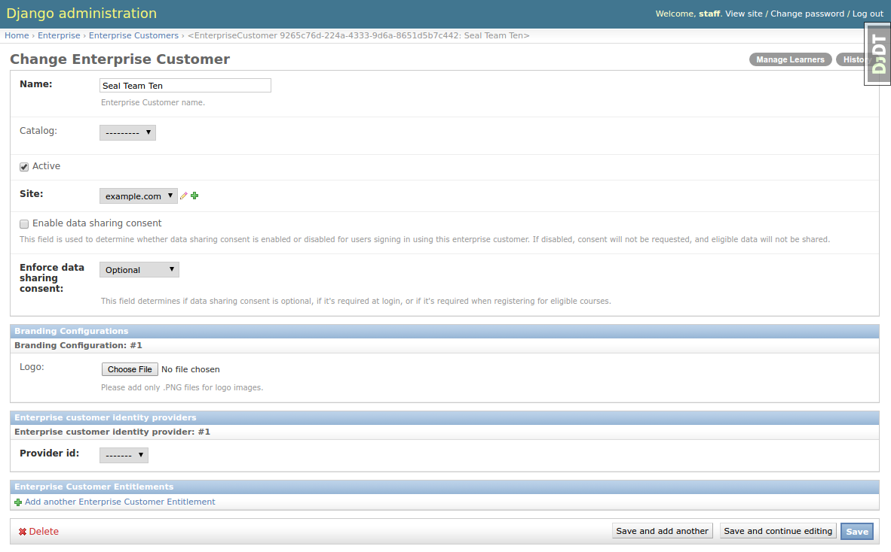
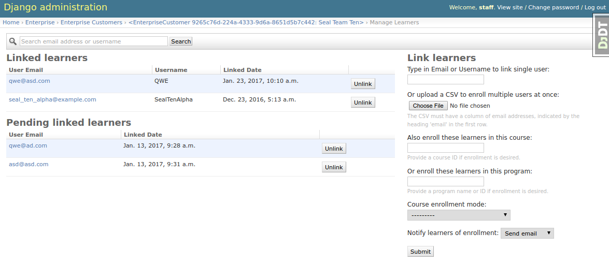
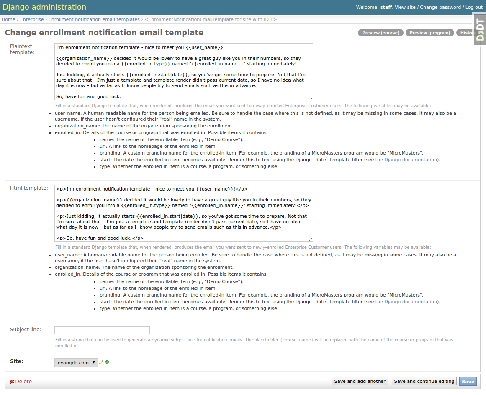

Configuration and usage
=======================

Getting around the administrator interface
------------------------------------------

The ``edx-enterprise`` project is integrated with ``edx-platform`` Django admin. It can be accessed at
``$LMS_SERVER_ADDRESS/admin/enterprise``. The current administrator interface is considered provisional until an
independent full-featured enterprise portal is built, so not much time was spent on improving admin tools UX.

.. image:: images/enterprise-admin.png

So far, there are four items in the admin interface:

* "Enrollment notification email templates" - manages templates used to build enrollment notifications.
* "Enterprise Customers" - lists and manages Enterprise Customer records.
* "Enterprise Customer Users" - lists and manages students associated with Enterprise Customers.
* "Pending Enterprise Customer Users" - lists and manages "pending" Enterprise Customer students.

The ``edx-enterprise`` admin site provides two ways to manage learners: The "Enterprise Customer Users" section
mentioned above, and the "Manage Learners" view. The "Manage Learners" view is recommended as it is easier to understand
and provides more features. To access it, first go to the "Enterprise Customer" section of the admin site, then click
on a customer, and then click on the "Manage Learners" button in the top-right corner of the page.

Manage Learners View
--------------------

The Manage Learners view is meant to be used by non-technical staff to administer enterprise learners.
It can be used to:

* Associate ("link") and disassociate ("unlink") existing students with an Enterprise Customer.
* Associate learners with an Enterprise customer even if they don't have an account yet (these
  learners are known as "Pending Enterprise Customer Learners"). Pending Enterprise Customer Learners are
  identified by their email address only.
* Manually enroll groups of enterprise learners into courses and/or programs.

Integrating with the Course Catalog
^^^^^^^^^^^^^^^^^^^^^^^^^^^^^^^^^^^

In order for course enrollment features to work, ``edx-enterprise`` talks to the `Course Catalog Service`_. Instructions
on how to set up and configure the Course Catalog service can be found at corresponding `docs section`_ of Course
Catalog and in ``edx-enterprise`` `Pull Request #7`_ (describes developer setup, but useful for a broader audience).

One particular quirk is that the Course Catalog Service, being an independent application, restricts access to
courses and programs according to ownership rules, so only users with certain roles can list all programs and courses,
as the ``edx-enterprise`` admin interface expects. This is covered in greater detail in aforementioned docs section.

.. _Course Catalog Service: https://open-edx-course-catalog.readthedocs.io/en/latest/getting_started.html
.. _docs section: https://open-edx-course-catalog.readthedocs.io/en/latest/getting_started.html#lms-integration
.. _Pull Request #7: https://github.com/openedx/edx-enterprise/pull/7

Managing Linked Learners Lists
^^^^^^^^^^^^^^^^^^^^^^^^^^^^^^

The Manage Learners view allows for two modes of linking users to an Enterprise Customer:

* Singular - A single user email address or username is provided.
* Bulk - A CSV file containing a single column of email addresses is uploaded.

When linking a single user by username, ``edx-enterprise`` tries to find an existing user with that username and fails
the linking if a match was not found. When email address is used (either in singular or bulk mode), existing users using
that email address are linked to the Enterprise Customer. If an email address match was not found, a "Pending Linked
Learner" record is created for that email address. If that email address is used to register a new user, then that user
is automatically linked with the Enterprise Customer.

**Note:** Each learner can be linked only to one Enterprise Customer, so linking fails if the learner is already
associated with some other enterprise customer.

The Manage Learners view also enables unlinking "Linked Learners" and "Pending Linked Learners."

Enrolling Learners into a Course or Program
^^^^^^^^^^^^^^^^^^^^^^^^^^^^^^^^^^^^^^^^^^^

Enrolling learners into courses or programs depends on Course Catalog integration, because ``edx-enterprise`` uses the
Course Catalog API to fetch course and program information.

When "Course ID" input is filled, "Program ID" input is blocked and "Course Enrollment Mode" is automatically populated
with course modes available for chosen course.

When "Program ID" input is filled, "Course ID" input is blocked and "Course Enrollment Mode" is reset to a list of all
course enrollment modes\ [#f1]_

Enrollment notification email templates
---------------------------------------

When learners are enrolled into a course or program, admins might choose to send enrollment notification emails.
This admin section manages templates used to build such emails.

The template engine supports plaintext and HTML emails and allows substituting certain placeholders with real values,
which are pulled from enrollment data (i.e. username, organization, course or program name, etc.). For details, refer
to the help strings provided by the form.

You can preview emails in the template edit view using the "Preview (program)" and "Preview (course)" buttons in
top-right corner.

Integrated Channels
-------------------

SAP SuccessFactors Configuration
^^^^^^^^^^^^^^^^^^^^^^^^^^^^^^^^

One of the integrated channels available for an ``EnterpriseCustomer`` is `SAP SuccessFactors`_.

To integrate an ``EnterpriseCustomer`` with SAP SuccessFactors:

* Set up a `TPA SAML Integration`_ for the SAP SuccessFactors endpoint.
* From the LMS Admin, ensure that your ``EnterpriseCustomer`` record has its ``identity_provider`` field pointing to the
  SAML Integration created in the previous step.

  This allows learners to create accounts using Single Sign-On from SAP SuccessFactors, and to have their course
  completion records sent back to SAP SuccessFactors.
* From the LMS Admin, create an ``SAP SuccessFactors Enterprise Customer Configuration`` record, and link it to your
  ``EnterpriseCustomer``.

  Ensure that the record is marked ``Active`` to allow the management commands below to send data via this channel.

.. _SAP SuccessFactors: https://www.successfactors.com
.. _TPA SAML Integration: https://docs.openedx.org/en/latest/site_ops/install_configure_run_guide/configuration/tpa/tpa_SAML_SP.html

Management Commands
^^^^^^^^^^^^^^^^^^^

These Django management commands send data to ``EnterpriseCustomer``'s active, integrated channels.

They must be run from the command line on a server with the Open edX environment installed.

.. note::

   If data sharing consent is enabled for your ``EnterpriseCustomer``, then any Enterprise learners enrolled in the
   associated courses must consent to data sharing, thus permitting their data to be sent back to SAP SuccessFactors.

   If data sharing consent is *not* enabled for your ``EnterpriseCustomer``, then learner data may be sent to SAP
   SuccessFactors without their explicit consent, so use these settings with care.

Transmit Learner Data
_____________________

The ``transmit_learner_data`` command sends course completion data for each ``EnterpriseCustomerCourseEnrollment`` where
evidence of course completion exists for an enrolled learner.

.. note::

   "Course completion" is determined by differently for different types of courses.

   * Instructor-paced course enrollments are deemed "complete" by the presence of a certificate for a given learner and
     course.  The grade reported is pulled from the certificate.
   * Self-paced courses with an end date are deemed "complete" once the end date has passed.  The grade reported is
     "Pass" or "Fail", pulled from the Grades API, as of the current date.
   * Self-paced courses with no end date are deemed "complete" once the learner passes the course.  If the learner has
     not yet passed the course, the grade is reported as "In Progress".

Usage
~~~~~

.. code-block:: bash

   # Login as the edxapp user, and enable the edxapp environment.
   $ sudo -u edxapp -Hs
   $ cd ~
   $ source edxapp_env   # adds $EDX_PLATFORM_SETTINGS to the environment, e.g. aws, openstack, devstack..

   # View command help
   $ ./manage.py lms transmit_learner_data --help --settings=$EDX_PLATFORM_SETTINGS

   # Transmit learner data for all EnterpriseCustomers, to all active integrated channels.
   # * --api_user must be a user with staff access to all the courses linked to the EnterpriseCustomers.
   $ ./manage.py lms transmit_learner_data --api_user staff --settings=$EDX_PLATFORM_SETTINGS

   # Transmit learner data for a single EnterpriseCustomer, e.g. with uuid 12
   $ ./manage.py lms transmit_learner_data --api_user staff --enterprise-customer 12 --settings=$EDX_PLATFORM_SETTINGS

   # Transmit learner data only to SAP SuccessFactors
   $ ./manage.py lms transmit_learner_data --api_user staff --channel SAP --settings=$EDX_PLATFORM_SETTINGS

.. rubric:: Footnotes

.. [#f1] Course Catalog Service API does not expose any means to get a list of modes supported by *all* courses in the
  program, so it relies on the administrator to choose the right mode. However, validation is performed on the back
  end, and if an unavailable mode is chosen, a list of available modes is shown in an error message.
