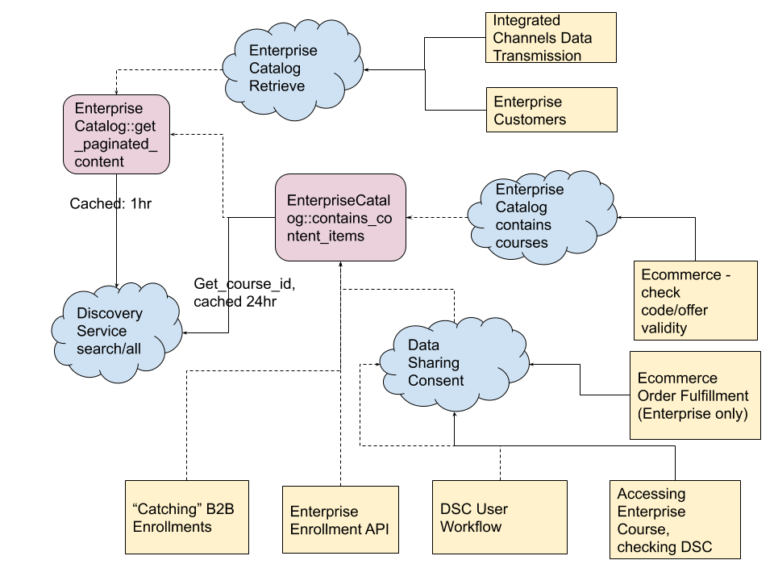
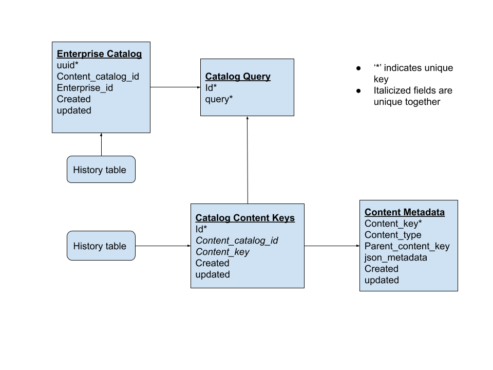
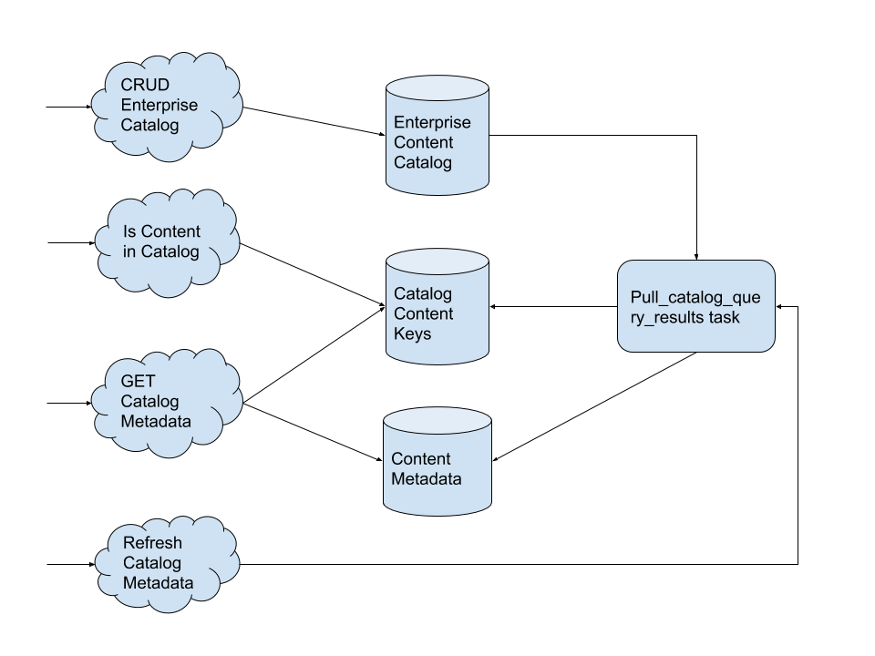

New Enterprise Catalog IDA
--------------------------

Status
======

Draft

Context
=======
We are interested in improving the reliability and performance of our system at large, and we have identified that the enterprise catalog api and related functionality are a central dependency that often causes issues, such as users experiencing random failures during enrollment or other workflows. Almost every feature that our users interact with depends on enterprise catalogs: Enrollment, Code Redemption, Data Sharing Consent, Data transmission to external LMS systems, and API access given to select customers.

Our main goals are as follows:

1. Get the response time of the enterprise customer catalog endpoints to be below 1 second for 99% of calls.

2. Since many features do not hit the enterprise catalog api endpoints but perform the same calculations directly in code, we would also like to improve the performance of those code paths and drastically reduce the calls to the discovery service.
Examples include the data sharing consent workflow, the enterprise enrollment api, and the task that "catches" enterprise enrollments from the B2C site.

What is Enterprise Catalog?
___________________________

Enterprise catalogs are essentially saved elasticsearch queries attached to an Enterprise Customer. There can be many catalogs configured for a given customer, which enables different sets of learners from the same Enterprise to be given access to different sets of courses, and allows different discounts to be configured for different sets of courses.

We expose two apis that are frequently used by various enterprise features: one to retrieve all of the content metadata that would be returned by the configured catalog query, and one to determine if a given course id or program id is part of the set of content returned by the catalog query. These apis exist both as python apis and REST apis that can be hit from within our edX ecosystem and externally from customers. They are wrappers around the search/all endpoint in the discovery service. Although there is caching in place, the calls to discovery are implemented synchronously, and we've found that half the time requests do not hit the cache, and thus the most of the time is spent waiting on the discovery service to return results.

Who’s Calling What now?
_______________________

Here is a diagram showing a simplified view of the calls to these apis. The yellow boxes represent the features or user workflows that trigger calls to the various apis. The blue clouds represent REST apis, and the purple rounded boxes represent python code apis. Solid lines are synchronous api calls and dotted lines are code apis (not hitting the network).

Decisions
=========

In order to address these performance issues and to more effectively scale and build new features related to enterprise catalogs in the future, we will create a new IDA (Independently Deployable Application) to replace the existing enterprise catalog functionality.
This IDA will support the existing API contracts established in the edx-enterprise API, but will be a new implementation separate from what we do today.

The microservice will be supported by the following relational data model:

The microservice will expose the following APIs for use:

* CRUD Operations for Enterprise Catalog
* is content id in catalog: Given a course, course run, program, or other content id, and an enterprise catalog, returns true if the content id is contained within the catalog's current results.
* get_catalog_metadata: Given an enterprise catalog, return the full content metadata results for content currently in the catalog.
* pull_catalog_query_results: Given an enterprise catalog, kick off a task to get the freshest content metadata for that catalog.

All metadata will be fetched from the discovery service through asynchronous tasks that are entirely decoupled from when a call is made to get metadata for a particular catalog. We will guarantee that catalog data is fresh within the past 24 hours. Catalog refreshes will be performed through asynchronous tasks whenever a catalog is created or updated, when it is manually refreshed, or on a daily cadence. We will also gain efficiencies by deduping elasticsearch queries across different enterprise catalogs so that catalogs with the same query only fetch data from discovery once.

We will maintain the existing api signature so that the only update current api clients will have to make is to the url; request and response data will maintain the same format.

We will transition all internal api calls (both code and network calls) to use this new service. Once this transition is complete, we will deprecate and remove the original functionality contained in this repo.

Consequences
============

Transitioning to this new service will require careful consideration, since many internal systems as well as external clients rely on this API. Network calls should be simple enough to swap out, but within edx-enterprise there are many code api calls to enterprise catalogs, and these will be tougher to transition. We will need to be mindful of how we are caching data from this new service throughout our system. Hopefully, it can be kept to a minimum because this api should be much more performant.

This will also be the first enterprise specific IDA, which will require us to gain an understanding and ownership of a service from end to end. This should include monitoring and alerting SLAs that we expect the service to maintain. Hopefully this will allow us to move towards extracting more functionality in this repo out to microservices.
