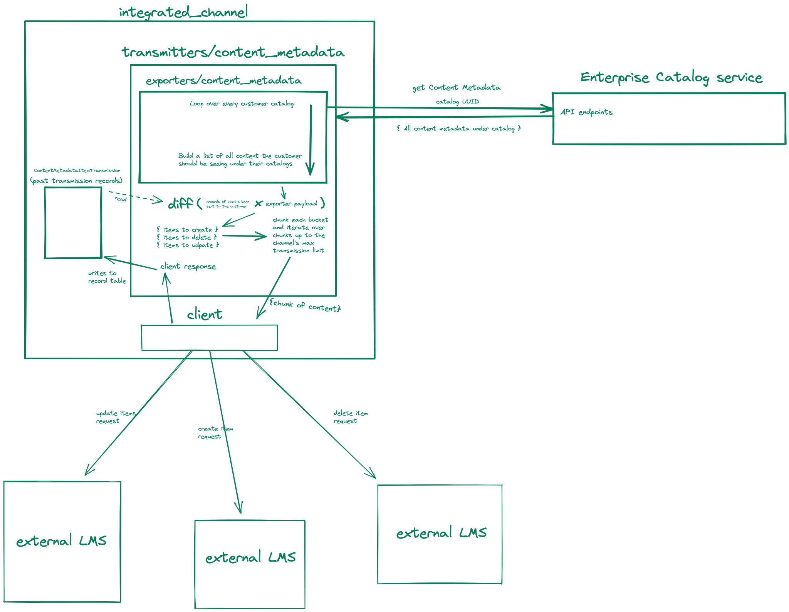
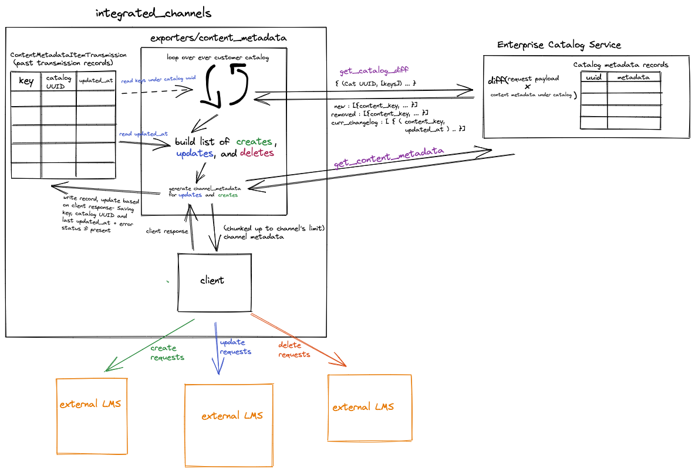

Moving the responsibility of catalog diffing to the enterprise-catalog service
------------------------------------------------------------------------------

Status
======

Accepted

Context
=======

Recent, now reverted, attempts to make efficiency improvements to the integrated channels requesting data from the
enterprise catalogs have highlighted short comings of the current architecture in terms of the capabilities of the
Integrated Channels to accurately report the last time a customer's full catalog has been successfully updated. Because
the Integrated Channels are responsible for chunking transmissions (only sending as much as the individual channel's API
allows at a given time) such that not all content under a customer's catalog is guaranteed to be transmitted in a single
scheduled run, we cannot accurately determine if all content under a customer's catalog has been updated since the
catalog has last updated without first using the enterprise catalog's currently available API `get_content_metadata`
endpoint.

- **How do the Integrated Channels currently handle customer catalog data?**

Existing flow chart:

Currently on a scheduled job, the Integrated Channels' content metadata exporter iterates over each customer's catalog
and builds up a dict of content representing the current state of the customer's catalog content. Take away: as it
stands now, the Integrated Channels assumes that the content metadata exporter will report the entirety of the
customer's purchased content, then pass that payload to the content metadata transmitter which compares the payload with
all saved `ContentMetadataItemTransmission` items under the customer to determine which items it (the transmitter) needs
to create, update, and delete. It then chunks up each of the buckets, and sends those chunks (up to a limited number of
times) to the client to send to the customer's LMS and saves the updated `ContentMetadataItemTransmission` entry.

- **Why does this matter?**

**querying all content from the catalog service is expensive**- Asking for all content under the catalog, for every
customer, for every catalog, on every transmission is not only an undesirably large request to be sending, but also
consumes much of the enterprise catalog's DB load. We need a smarter solution to how the Integrated Channels requests
content from the catalog service.

**putting the responsibility of determining differences** between what's already been sent to the customers and what's
currently in customer's catalogs adds much complexity to the integrated channels which can make it unapproachable from
an onboarding perspective but also from a debugging point of view. Log noise and number of potential error sources means
tracking down issues within the Integrated Channels are time consuming and thus, costly.

Decisions
=========

- **How the Integrated Channels could better determine if customer metadata needs updating**

Proposed flow chart:

When we build an endpoint that takes a catalog UUID and a set of content keys linked to the uuid and returns three buckets
of data:

1) What the last `updated_at` times of the content keys are for the content keys provided that are under the specified
catalog

2) What content keys exist under the specified catalog that were not provided in the list of content keys

3) What content keys don't exist under the specified catalog that were provided in the list of content keys

We would be able to move the responsibility of diffing what we believe the customer has with what the customer should
have, to the enterprise-catalog service via a new API endpoint. This would mean that the only job of the Integrated
Channels would be to compare the last updated times of the content that already exist to get which content need updates,
creates and deletes would already determined by the first endpoint.

Consequences
============

Adding the new diffing enterprise-catalog service API endpoint would allow us to accurately determine if catalog updates
are needed for any particular iteration of the content metadata transmissions. We would be able to limit the number of
calls needed to the enterprise-catalog service, saving time and DB load since the content_metadata endpoint is a hefty
one. It would also allow us to easily implement a filtered content retrieval endpoint in the future such that we won't
have to fetch any extraneous content whatsoever. Additionally these changes cut back on the complexity of the
integrated channels, making it easier to approach and accurately identify future issues. Lastly, it moves the source of
truth of catalog content information to the enterprise-catalog service and out of the Integrated Channels which should
not be handling that responsibility in the first place.

Further Improvements
====================

There are two additional improvements to explore with the Integrated Channels' metadata transmission flow. Firstly,
we remove records from our transmission audit table when a delete request is issued. This can result in `lost` nodes of
content (as we've actively seen from customers) where content can be assumed to be deleted on our end but have it exist
still on the customer's external LMS. The fix here is pretty easy- if we choose to not delete records, but rather create
a new, nullable `deleted_at` or equivalent field in the transmission record table. Then we would be able to mark and
exclude any deleted records from appropriate look ups, but still have something to help us identify past courses that
were sent to customers.

As stated earlier, currently the only method to retrieve content under a customer's catalog is the singular, bulk
`get_content_metadata` endpoint. This returns all content metadata belonging to an enterprise catalog. If we were to
build out the existing endpoint where individual content key's worth of metadata could be specified in the request body,
then we would be able to further reduce the amount the Integrated Channels request unused data.

