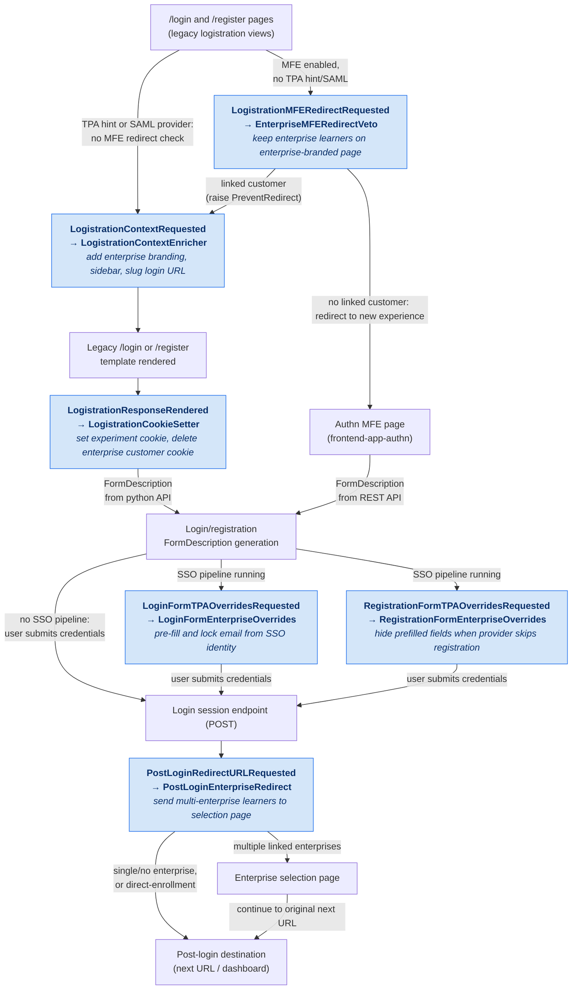

# 0016. Centralize enterprise logistration logic behind openedx-filters

## Status

Accepted

## Context

Three logistration views in openedx-platform (`user_authn/views/login_form.py`,
`registration_form.py`, and `login.py`) directly import enterprise functions from
`openedx.features.enterprise_support` to customize login and registration behavior
for enterprise learners:

- enriching the logistration page context with enterprise customer branding and
  sidebar data;
- setting/deleting enterprise cookies on the rendered logistration response;
- pre-filling and locking the email field on the login form during an enterprise
  SSO (third-party auth) pipeline;
- hiding provider-prefilled registration fields when an enterprise SSO provider
  skips the registration form;
- keeping enterprise customers on the legacy enterprise-branded logistration page
  instead of redirecting them to the Authn MFE;
- redirecting learners linked to multiple enterprise customers to the enterprise
  selection page after login.

These imports make edx-enterprise a hard dependency of core authentication code.
As part of the broader initiative to convert edx-enterprise into an optional
Open edX plugin, all `enterprise` / `enterprise_support` imports must be removed
from openedx-platform and replaced with generic hooks whose enterprise-specific
implementations live in this repository.

## Decision

We will replace the enterprise imports in the three logistration views with six
new, enterprise-agnostic openedx-filters, and implement the enterprise behavior
as filter pipeline steps in `enterprise/filters/logistration.py`:

| openedx-filter (triggered by platform)   | edx-enterprise pipeline step          |
| ---------------------------------------- | ------------------------------------- |
| `LogistrationContextRequested`           | `LogistrationContextEnricher`         |
| `LogistrationResponseRendered`           | `LogistrationCookieSetter`            |
| `LoginFormTPAOverridesRequested`         | `LoginFormEnterpriseOverrides`        |
| `RegistrationFormTPAOverridesRequested`  | `RegistrationFormEnterpriseOverrides` |
| `LogistrationMFERedirectRequested`       | `EnterpriseMFERedirectVeto`           |
| `PostLoginRedirectURLRequested`          | `PostLoginEnterpriseRedirect`         |

Key design points:

- **Filter names are generic.** No filter class name, filter type, or docstring
  mentions "enterprise"; other plugins can reuse the same hooks.
- **The platform resolves third-party-auth state once.** The two form-override
  filters are triggered only when third-party auth is enabled and an auth
  pipeline is running; the platform passes the resolved `running_pipeline` and
  `current_provider` into the filter so pipeline steps never import
  `third_party_auth`. `FormDescriptionProtocol` and `ProviderConfigProtocol`
  structural types in openedx-filters declare the minimal surface these steps
  may rely on.
- **No request in filter payloads** (except `LogistrationMFERedirectRequested`,
  where the request is the only input). Steps that need it use
  `crum.get_current_request()`, consistent with this project's other filters.
- **MFE redirect veto via exception.** `EnterpriseMFERedirectVeto` raises
  `LogistrationMFERedirectRequested.PreventRedirect` for enterprise customer
  requests, keeping them on the legacy logistration page, which is the only
  page that renders enterprise branding and the data-consent messaging.
- **Pipeline steps are registered by the plugin.** All six steps are mapped in
  `ENTERPRISE_FILTERS_CONFIG` in `enterprise/settings/common.py` and injected
  into the platform's filter configuration by the enterprise plugin settings —
  nothing is added to `lms/envs/common.py`.

### Logistration flow (high level)

Each block is a page, an endpoint, or a filter paired with the enterprise
pipeline step that implements it (shaded).

## Consequences

- `login_form.py`, `registration_form.py`, `login.py`, and `views/utils.py` in
  openedx-platform no longer import `enterprise_support`; the logistration
  surface of the platform works with edx-enterprise uninstalled.
- Enterprise logistration behavior is now discoverable in one module
  (`enterprise/filters/logistration.py`) instead of being spread across
  platform views and `enterprise_support` helpers.
- Behavior for non-enterprise requests is preserved: `LogistrationContextEnricher`
  runs its context update unconditionally, matching the original platform
  behavior (e.g. `enable_enterprise_sidebar=False`, third-party-auth error
  message adjustments), and the `experiments_is_enterprise` cookie continues to
  be set for Optimizely experiment audiences.
- Deployments that disable the enterprise plugin lose enterprise logistration
  branding, SSO form overrides, and the multi-enterprise selection redirect —
  which is the intended semantics of an optional plugin.
- The filter contracts (six filter types plus the two protocols) become a public
  API in openedx-filters that must be evolved with its deprecation policy.

## Alternatives considered

- **`StudentRegistrationRequested` for registration field gating** — rejected:
  it runs at submission time on POSTed form data and cannot affect field
  visibility in the generated form description.
- **Django signals** — rejected: every hook here must return data to the caller
  (context, form description, redirect URL) or veto a decision, which signals
  do not support well.
- **Pluggable overrides** — rejected: multiple override implementations would
  silently shadow each other, whereas filter pipelines compose sequentially.
- **Middleware** — rejected: logistration customization is view-specific;
  middleware would run on every request for logic that applies to a handful of
  endpoints.

## References

- JIRA: ENT-11568
- openedx-filters PR: https://github.com/openedx/openedx-filters/pull/337
- openedx-platform PR: https://github.com/openedx/openedx-platform/pull/38105
- edx-enterprise PR: https://github.com/openedx/edx-enterprise/pull/2551
