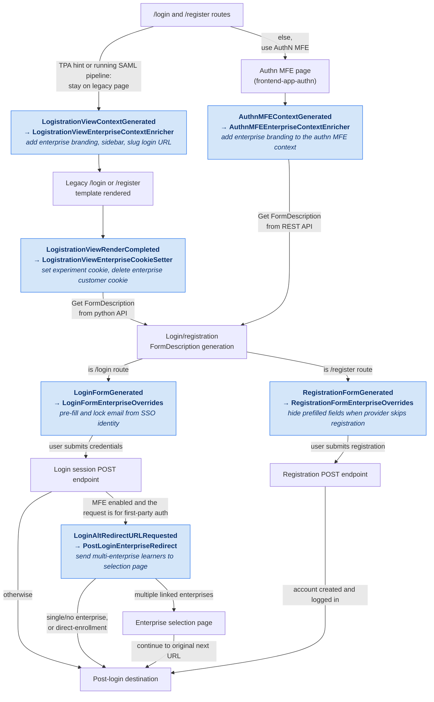

# 0016. Centralize enterprise logistration logic behind openedx-filters

## Status

Accepted

## Context

The `user_authn` module in openedx-platform
(`openedx/core/djangoapps/user_authn/`) includes several direct imports of
enterprise functions from `enterprise_support` and `enterprise` to customize
login and registration behavior for enterprise learners.  The
enterprise-specific business logic includes:

- Enriching the legacy logistration page context and the authentication MFE
  context with enterprise customer branding and sidebar data.
- Setting/deleting enterprise cookies on the rendered logistration response.
- Pre-filling and locking the email field on the login form during an enterprise
  SSO (third-party auth) pipeline.
- Hiding provider-prefilled registration fields when an enterprise SSO provider
  skips the registration form.
- Redirecting learners linked to multiple enterprise customers to the enterprise
  selection page after login.

These imports make edx-enterprise a hard dependency of core authentication code.
As part of the broader initiative to convert edx-enterprise into an optional
Open edX plugin, all `enterprise` / `enterprise_support` imports must be removed
from openedx-platform and replaced with generic hooks whose enterprise-specific
implementations live in this repository (edx-enterprise).

## Decision

We will replace the enterprise-specific logic in `user_authn` with six new
enterprise-agnostic openedx filters, and reimplement the enterprise behavior as
filter pipeline steps within edx-enterprise:

| openedx-filter (triggered by platform)   | edx-enterprise pipeline step                | Business Logic                                            |
| ---------------------------------------- | ------------------------------------------- | --------------------------------------------------------- |
| `LogistrationViewContextGenerated`       | `LogistrationViewEnterpriseContextEnricher` | add enterprise branding, sidebar, slug login URL (legacy) |
| `AuthnMFEContextGenerated`               | `AuthnMFEEnterpriseContextEnricher`         | add enterprise branding to the authentication MFE context |
| `LogistrationViewRenderCompleted`        | `LogistrationViewEnterpriseCookieSetter`    | set experiment cookie, delete enterprise customer cookie  |
| `LoginFormGenerated`                     | `LoginFormEnterpriseOverrides`              | pre-fill and lock email from SSO identity                 |
| `RegistrationFormGenerated`              | `RegistrationFormEnterpriseOverrides`       | hide prefilled fields when provider skips registration    |
| `LoginAltRedirectURLRequested`           | `PostLoginEnterpriseRedirect`               | send multi-enterprise learners to selection page          |

These six filters live in the new `authentication` architecture subdomain in openedx-filters.

### Logistration flow (high level)

Each block is a page, an endpoint, or a filter paired with the enterprise
pipeline step that implements it (shaded).

```mermaid
%%{init: {"flowchart": {"rankSpacing": 30}}}%%
flowchart TD
    classDef ent fill:#d4e6f9,stroke:#1f6feb,color:#0a3069

    LogistrationViewContextGenerated["<b>LogistrationViewContextGenerated</b><br/>→&nbsp;<b>LogistrationViewEnterpriseContextEnricher</b><br/><i>add enterprise branding, sidebar, slug login URL</i>"]:::ent
    AuthnMFEContextGenerated["<b>AuthnMFEContextGenerated</b><br/>→&nbsp;<b>AuthnMFEEnterpriseContextEnricher</b><br/><i>add enterprise branding to the authn MFE context</i>"]:::ent
    LogistrationViewRenderCompleted["<b>LogistrationViewRenderCompleted</b><br/>→&nbsp;<b>LogistrationViewEnterpriseCookieSetter</b><br/><i>set experiment cookie, delete enterprise customer cookie</i>"]:::ent
    LoginFormGenerated["<b>LoginFormGenerated</b><br/>→&nbsp;<b>LoginFormEnterpriseOverrides</b><br/><i>pre-fill and lock email from SSO identity</i>"]:::ent
    RegistrationFormGenerated["<b>RegistrationFormGenerated</b><br/>→&nbsp;<b>RegistrationFormEnterpriseOverrides</b><br/><i>hide prefilled fields when provider skips registration</i>"]:::ent
    LoginAltRedirectURLRequested["<b>LoginAltRedirectURLRequested</b><br/>→&nbsp;<b>PostLoginEnterpriseRedirect</b><br/><i>send multi-enterprise learners to selection page</i>"]:::ent

    LP["/login and /register routes<br/>"]
    MFE["Authn MFE page<br/>(frontend-app-authn)"]
    FORMS["Login/registration<br/>FormDescription generation"]
    LOGINPOST["Login session POST endpoint"]
    REGPOST["Registration POST endpoint"]
    RENDERED["Legacy /login or /register<br/>template rendered"]
    SEL["Enterprise selection page"]
    DEST["Post-login destination"]

    LP -- "else,<br/>use AuthN MFE" --> MFE
    LP -- "TPA hint or running SAML pipeline:<br/>stay on legacy page" --> LogistrationViewContextGenerated
    LogistrationViewContextGenerated --> RENDERED
    RENDERED --> LogistrationViewRenderCompleted
    LogistrationViewRenderCompleted -- "Get FormDescription<br/>from python API" --> FORMS
    MFE --> AuthnMFEContextGenerated
    AuthnMFEContextGenerated -- "Get FormDescription<br/>from REST API" --> FORMS
    %% invisible edge: pin AuthnMFEContextGenerated to the same rank as
    %% LogistrationViewContextGenerated so both *ContextGenerated filters render on the same level
    AuthnMFEContextGenerated ~~~ RENDERED
    FORMS -- "is /login route" --> LoginFormGenerated
    FORMS -- "is /register route" --> RegistrationFormGenerated
    %% invisible edge: pin LoginFormGenerated to the same rank as
    %% RegistrationFormGenerated so both *FormGenerated filters render on the same level
    LoginFormGenerated ~~~ REGPOST
    LoginFormGenerated -- "user submits credentials" --> LOGINPOST
    RegistrationFormGenerated -- "user submits registration" --> REGPOST
    LOGINPOST -- "MFE enabled and the request is for first-party auth" --> LoginAltRedirectURLRequested
    LOGINPOST -- "otherwise" --> DEST
    LoginAltRedirectURLRequested -- "multiple linked enterprises" --> SEL
    LoginAltRedirectURLRequested -- "single/no enterprise,<br/>or direct-enrollment" --> DEST
    SEL -- "continue to original next URL" --> DEST
    REGPOST -- "account created and logged in" --> DEST
```

### Integration Testing

As part of this work, the SAML provisioning suite within edx-enterprise (`make
dev.provision.keycloak`) will be significantly enhanced to support the many
test scenarios, especially multi-IdP test scenarios.

Additionally, a new integration test script
`scripts/provision-integration-test-ENT-11568.sh` will facilitate in rendering
the exact test scenario setup and expected outcomes.

## Consequences

- The entire `user_authn` platform module (`openedx/core/djangoapps/user_authn/`)
  no longer imports `enterprise_support` or `enterprise`, bringing us one step
  closer to removing edx-enterprise as a hard platform dependency.
- Enterprise-specific logistration behavior is now centrally discoverable in one
  module (`enterprise/filters/logistration.py`) instead of being spread across
  platform views and `enterprise_support` helpers.
- The added filters created in service of this ticket can also serve as
  general-purpose hooks for other logistration-altering plugins.

## Rejected Alternatives

- **Pluggable overrides** — As the primary plugin hook alternative to
  openedx-filters, pluggable overrides would have been a poor choice
  semantically because all the hook locations are reasonably general purpose.
- **Django signals** — rejected: every hook here must return data to the caller
  (context, form description, redirect URL), which signals do not support well.
- **Middleware** — rejected: logistration customization is view-specific;
  middleware would run on every request for logic that applies to a handful of
  endpoints.  This approach could have significant performance impact.

## References

- JIRA: ENT-11568
- openedx-filters PR: https://github.com/openedx/openedx-filters/pull/337
- edx-enterprise PR: https://github.com/openedx/edx-enterprise/pull/2662
- edx-enterprise PR: https://github.com/openedx/edx-enterprise/pull/2551
- openedx/openedx-platform PR: https://github.com/openedx/openedx-platform/pull/38105
- edx/edx-platform PR (2U fork): https://github.com/edx/edx-platform/pull/407
